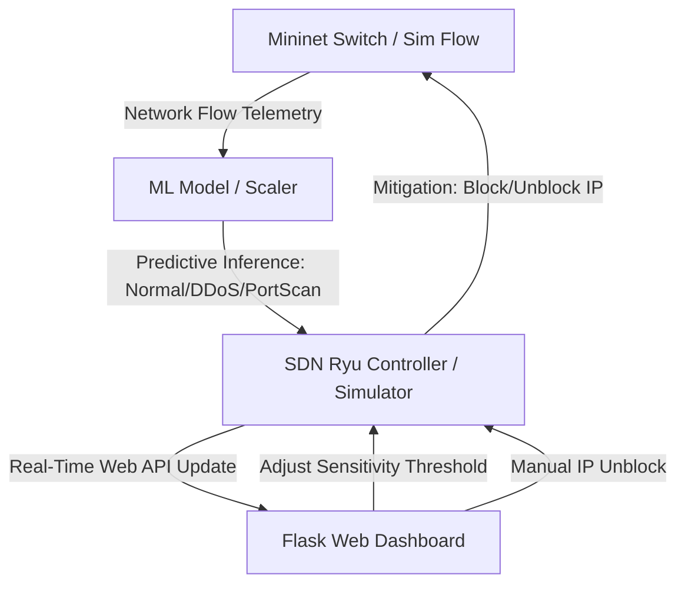

# 🛡️ AI-Driven Intrusion Detection System (IDS) for Software-Defined Networks (SDN)

An advanced, interactive, AI-powered Intrusion Detection System integrated with a Software-Defined Networking (SDN) controller (Ryu), Mininet emulation, and a premium real-time monitoring dashboard.

---

## 📋 Table of Contents
1. [Overview](#-overview)
2. [System Architecture](#-system-architecture)
3. [Repository Structure](#-repository-structure)
4. [Prerequisites & Installation](#-prerequisites--installation)
5. [Running the Project](#-running-the-project)
   - [Step 1: ML Model Training (Required for both modes)](#step-1-ml-model-training-required-for-both-modes)
   - [Mode A: Simulation Mode (Runs on any OS: Windows, macOS, Linux)](#mode-a-simulation-mode-runs-on-any-os-windows-macos-linux)
   - [Mode B: Full SDN Emulation Mode (Requires Linux / Ubuntu VM with Mininet)](#mode-b-full-sdn-emulation-mode-requires-linux--ubuntu-vm-with-mininet)
6. [Dashboard Live Monitoring](#-dashboard-live-monitoring)
7. [ML Model & Performance](#-ml-model--performance)
8. [Troubleshooting & Notes](#-troubleshooting--notes)

---

## 🔍 Overview
This project demonstrates how Machine Learning can secure Software-Defined Networks by automatically detecting and mitigating network attacks in real time. It implements:
* **Synthetic Traffic Generation**: Simulates realistic normal traffic, DDoS, and Port Scan attacks.
* **Random Forest Classifier**: Trained on flow metrics to identify anomalies with highly precise classification.
* **Real-time Threat Mitigation**: Dynamically inserts OpenFlow rules to drop malicious traffic at the switch level.
* **Premium Dashboard**: A Flask-based responsive monitoring interface showing live flows, bandwidth, system status, active alerts, and ML performance metrics.

---

## 🏗️ System Architecture


---

## 📁 Repository Structure
```text
AI_IDS_SDN/
│
├── dashboard/               # Flask Web Application
│   ├── app.py               # Main Flask server
│   ├── templates/
│   │   └── index.html       # Dashboard HTML UI
│   └── static/
│       ├── script.js        # Live updates & chart handling
│       └── style.css        # Premium custom CSS styling
│
├── ml_model/                # Machine Learning Component
│   ├── dataset_generator.py # Generates synthetic network logs
│   ├── train_model.py       # Trains Random Forest and exports artifacts
│   ├── model_stats.json     # Saved evaluation metrics
│   ├── rf_model.pkl         # Trained Random Forest classifier
│   └── scaler.pkl           # Feature scaler
│
├── sdn/                     # Software-Defined Networking Emulation
│   ├── ryu_controller.py    # Ryu SDN Controller with inline ML IDS
│   └── topology.py          # Mininet custom topology script
│
├── run_simulation.py        # Independent network traffic simulator (No Mininet required)
├── requirements.txt         # Project dependencies
└── readme.md                # System documentation
```

---

## 🛠️ Prerequisites & Installation

### 1. General Setup (Any OS)
Install the general dependencies to run the ML training, web dashboard, and non-SDN simulator:
```bash
# Clone the repository
git clone <repository-url>
cd AI_IDS_SDN

# Install python packages
pip install -r requirements.txt
```

> [!NOTE]
> If you plan to run the full SDN Emulation Mode, you will need a Linux environment (e.g., Ubuntu VM or native Linux). Mininet and Ryu are not natively supported on Windows.

### 2. SDN Setup (Linux / Ubuntu VM Only)
To run the full SDN controller and network emulator:
```bash
# Install Mininet
sudo apt-get update
sudo apt-get install mininet openvswitch-testcontroller

# Install Ryu dependencies & Ryu (Python 3.8 or 3.9 recommended)
pip install ryu
```

---

## 🚀 Running the Project

### Step 1: ML Model Training (Required for both modes)
Before starting any simulation or controller, you must generate the synthetic dataset and train the ML classifier:

1. Generate the training dataset:
   ```bash
   python ml_model/dataset_generator.py
   ```
   *Creates `ml_model/synthetic_network_traffic.csv` with 20,000 synthetic flow samples.*

2. Train the Random Forest model:
   ```bash
   python ml_model/train_model.py
   ```
   *Tunes hyperparameters using Grid Search and saves `rf_model.pkl`, `scaler.pkl`, and evaluation metrics `model_stats.json` in `ml_model/`.*

---

### Mode A: Simulation Mode (Runs on any OS: Windows, macOS, Linux)
This mode does not require Mininet or Ryu. It uses a virtual simulation engine that feeds real-time traffic statistics and ML predictions directly into the dashboard.

1. **Start the Web Dashboard:**
   ```bash
   python dashboard/app.py
   ```
   *Dashboard starts at [http://localhost:5000](http://localhost:5000).*

2. **Launch the Traffic Simulator:**
   In a separate terminal, run:
   ```bash
   python run_simulation.py
   ```
   *This starts simulating network traffic, running it through the ML model, notifying the dashboard of attacks, and synchronizing blocking rules and sensitivity levels.*

3. **Explore the Interface:**
   Open [http://localhost:5000](http://localhost:5000) in your browser. You can trigger simulated attacks directly from the UI, adjust the model sensitivity threshold, and manually unblock blocked IPs!

---

### Mode B: Full SDN Emulation Mode (Requires Linux / Ubuntu VM with Mininet)
This is the complete physical emulation mode where a Ryu controller controls actual OpenFlow switches populated with Mininet virtual hosts.

1. **Start the Web Dashboard:**
   In Terminal 1:
   ```bash
   python dashboard/app.py
   ```

2. **Start the Ryu SDN Controller:**
   In Terminal 2:
   ```bash
   ryu-manager sdn/ryu_controller.py
   ```
   *The controller will load the ML model and wait for the switches to connect on port 6653.*

3. **Launch the Mininet Network Topology:**
   In Terminal 3 (requires root privileges):
   ```bash
   sudo python sdn/topology.py
   ```
   *This creates 1 switch, 4 hosts, and connects them to the running Ryu controller. It will open the `mininet>` command CLI.*

4. **Simulate Traffic in Mininet:**
   To test the IDS, generate traffic between hosts in the Mininet CLI:
   * **Normal Traffic**: `h1 ping -c 5 h2`
   * **DDoS Attack simulation (h1 flooding h2)**:
     ```bash
     mininet> h1 timeout 10 iperf -c 10.0.0.2 -u -b 100M -t 10
     ```
     *The controller will classify the massive flow rate as an attack, dynamically inject a drop rule for `h1`'s IP, and report the block to the Flask dashboard.*

---

## 📊 Dashboard Live Monitoring
The dashboard provides a premium interactive web interface:
* **Interactive Threat Sensitivity Slider**: Dynamically adjust the anomaly classification threshold. High sensitivity will flag anomalies at lower malicious probabilities.
* **Simulated Attack Controls**: Force specific attack vectors to test real-time visual reactions.
* **Interactive IP Blocklist**: Displays currently blocked attackers, with the ability to instantly **Unblock** any IP and resume its traffic.
* **Live Charts**: Real-time traffic throughput and active flows charts.
* **Model Diagnostics Tab**: Visualizes ML model evaluation stats, including confusion matrices and feature importance scores.

---

## 📈 ML Model & Performance
The model is a tuned Random Forest Classifier trained on:
1. `protocol_type` (TCP, UDP, ICMP)
2. `packet_size` (bytes)
3. `flow_duration` (ms)
4. `packet_rate` (packets/sec)
5. `byte_rate` (bytes/sec)

It classifies network traffic into three categories:
* **Normal (Class 0)**
* **DDoS (Class 1)**
* **Port Scan (Class 2)**

It achieves `>99%` accuracy under cross-validation. Detailed metrics and feature importances can be viewed directly under the **ML Diagnostics** section of the running dashboard.

---

## 💡 Troubleshooting & Notes
* **Ryu Python Compatibility**: Ryu officially runs on Python 3.8 and 3.9. If you encounter eventlet/greenlet issues on newer Python versions, try creating a conda or virtualenv running Python 3.8 or 3.9.
* **Address Already in Use**: If Flask port 5000 is taken, configure a different port in `dashboard/app.py` and update the port in `run_simulation.py` and `sdn/ryu_controller.py`.
* **Mininet Cleanup**: If Mininet crashes or exits abnormally, always run `sudo mn -c` to clean up residual virtual interfaces and switches.
